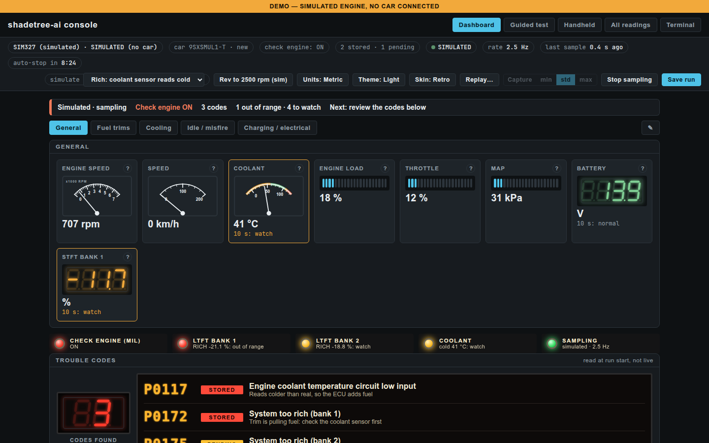
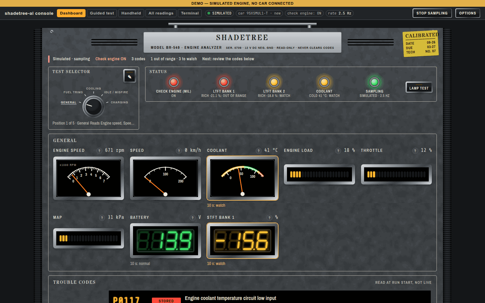
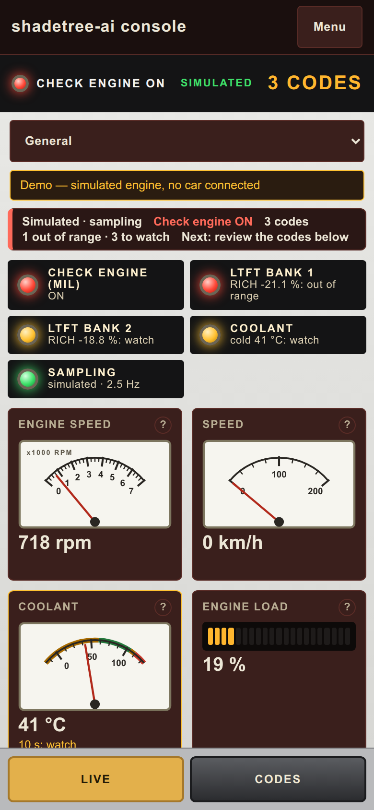
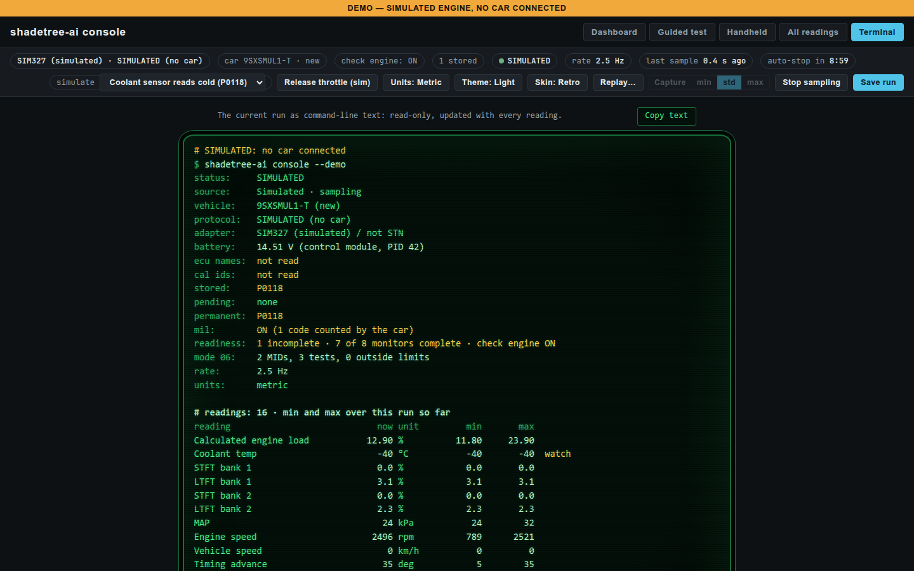
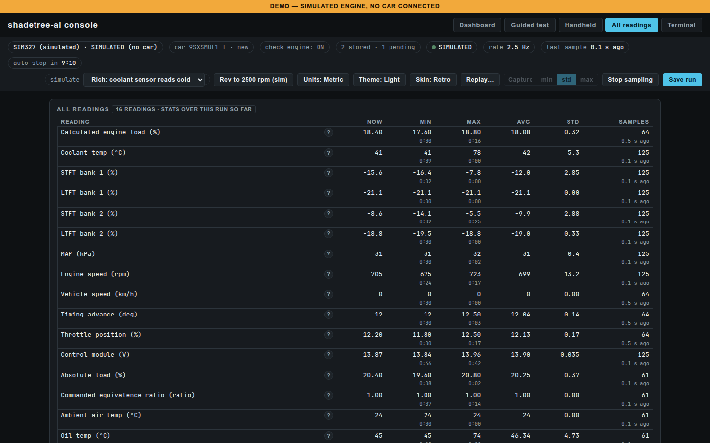
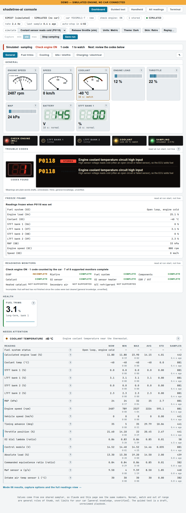
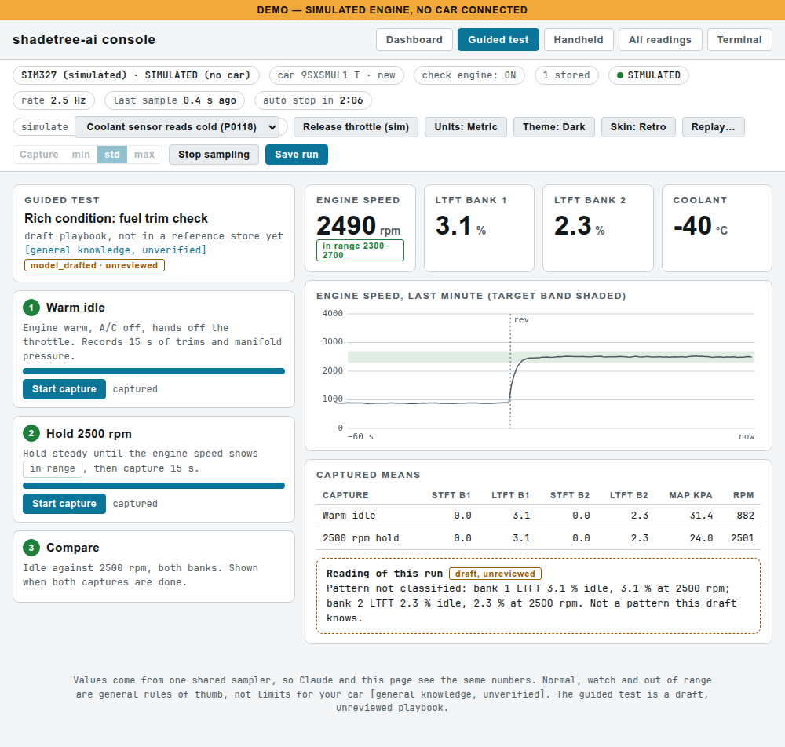
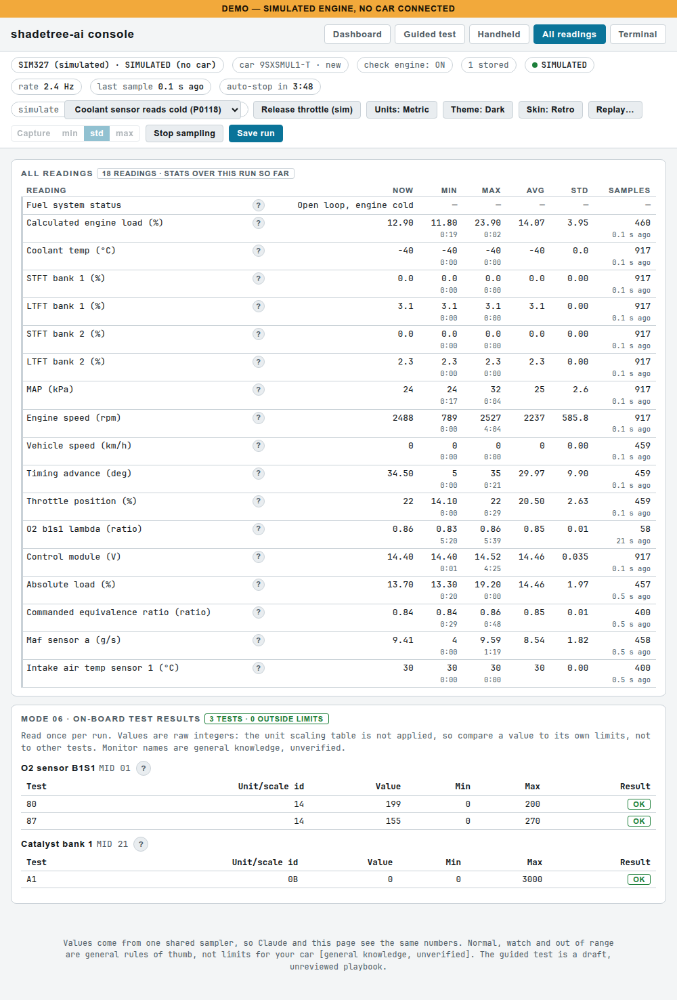

# shadetree-ai

Check engine light on? I gave Claude an OBD-II adapter and a strict read-only rule.

shadetree-ai is an MCP server that lets Claude read your car's trouble codes, freeze frame and live data through a USB OBD-II adapter and explain them, plus a local live dashboard in your browser that works without Claude.

**Claude is optional.** The dashboard and the command-line `scan` work standalone and make no AI calls: nothing in the program contacts Anthropic or any other AI service, and the plain-words code meanings are fixed text written ahead of time. There is one optional internet call, and only when you press its button: the NHTSA model lookup for a new car, which sends only the vehicle key characters (make, model and year codes; never the serial) and involves no AI. Claude is an extra layer on top, through the MCP server, if you want it.



## Features

- **Reads, never writes.** Trouble codes (stored, pending and, on CAN cars, permanent), the check-engine lamp, freeze frame, readiness monitors, Mode 06 test results and the VIN. It cannot clear codes or change anything on the car; this is enforced in code (see [Read-only safety promise](#read-only-safety-promise)).
- **Ask Claude about it.** 17 read-only MCP tools for Claude Code or Claude Desktop: scan the car, read saved scans, sample live data, open the dashboard. Claude explains what the codes and numbers mean. The reference library is not built yet, so those explanations come from Claude's general knowledge, not a service manual.
- **Live dashboard, no Claude needed.** A local web page with five views: Dashboard (gauge sets for fuel trims, cooling, idle/misfire and charging), Handheld (a phone layout), All readings (min, max, average and spread of every reading), Terminal (the run as copyable text) and a draft Guided fuel-trim test. Plain or Retro 1970s-analyzer skin, dark or light, metric or US units.
- **Plain-words code meanings.** Each code gets a one-line meaning and a hint. These are model-drafted and **nobody has reviewed them yet**; the page says so.
- **Phone in hand, laptop in the car.** Open the Handheld view on a phone on the same Wi-Fi.
- **Try it with no car.** A built-in simulated car (healthy, rich or lean), and replay of saved runs with play, pause, speed and a scrubber.
- **Record everything.** Every scan saves the raw adapter conversation and a parsed snapshot, so it can be replayed later. `probe` writes a report without the VIN that you can share.

| | |
|---|---|
|  |  |
| **Retro skin**: the Dashboard as a 1970s engine-analyzer cabinet | **Handheld**: the phone layout, Live and Codes modes |
|  |  |
| **Terminal**: the run as text, with a Copy button | **All readings**: statistics for every reading in the run |
|  |  |
| **Light theme Dashboard**: codes, freeze frame, readiness monitors and what needs attention | **Guided test**: the draft fuel-trim check with timed captures |
|  | |
| **All readings and Mode 06**: light theme, with on-board test results against their limits | |

All screenshots are of the built-in simulated car (the "rich" scenario), not a real vehicle.

## What you need

- An **OBDLink EX** USB adapter. It is the only adapter tested. The OBDLink CX has no J1850 support, and cheap ELM327 clones are not supported.
- A **1996 or newer US car** (OBD-II), on CAN or an older bus (J1850 PWM/VPW, ISO 9141, KWP2000). Not OBD-I, Tesla, Mercedes or cars with a secure gateway. Parked cars only.
- A laptop with Python 3.11 or newer (the Windows installer gets Python for you). Claude is optional.

Honest status: hardware-tested so far only on the OBDLink EX on the bench, one 2024 Honda Ridgeline (CAN) and one early-2000s GMC truck (J1850 VPW). ISO 9141, KWP and J1850 PWM are decoded but not yet tried on a real car, and the Windows installer has not yet been run on Windows. Details: [docs/status.md](docs/status.md).

## Install

### Windows (one-click installer)

Download the repository ZIP, extract it, right-click `install/install-windows.ps1` and choose **Run with PowerShell**. It installs Python if needed, installs shadetree-ai into `%LOCALAPPDATA%\Shadetree`, finds the adapter's COM port and puts **Shadetree**, **Shadetree demo (no car)**, **Shadetree with phone** and **Update Shadetree** icons on the Desktop. Step-by-step guide with troubleshooting: [docs/windows-start-here.md](docs/windows-start-here.md).

### Mac and Linux (pipx)

```
pipx install https://github.com/iamneilroberts/shadetree-ai/archive/refs/heads/main.zip
```

```
shadetree-ai console --demo
```

With the adapter plugged in (car parked, ignition on):

```
shadetree-ai console --port /dev/cu.usbserial-XXXX
```

- Mac: the port is `/dev/cu.usbserial-*` (`ls /dev/cu.usbserial-*` lists it).
- Linux: use `/dev/serial/by-id/...` (`ls /dev/serial/by-id/`) or `/dev/ttyUSB0`. "Permission denied" usually means your user is not in the `dialout` group.
- If an older car is not found, pin the protocol: `--protocol 2` (J1850 VPW, GM), `1` (J1850 PWM, Ford), `3` (ISO 9141), `5` or `4` (KWP).

The command prints a link like `http://127.0.0.1:8765/?t=<token>`; open it in a browser. In demo mode press **Demo** on the page. Update later with `pipx upgrade shadetree-ai` (or reinstall the zip with `--force`). Runs and transcripts are written to the folder you start it from; transcripts contain the VIN, so keep them private. The same pipx route works on Windows (`py -m pip install --user pipx`, then `py -m pipx ensurepath`; the port is a `COM` number from Device Manager).

### Claude Code and Claude Desktop (MCP)

The MCP server exposes 17 read-only tools: 9 offline tools that read saved snapshots and 8 live tools that talk to the adapter (including `open_console`, which starts the dashboard, and `console_data`, which reads its numbers). After the pipx install, register it with Claude Code (`SHADETREE_HOME` holds `snapshots/` and `transcripts/`, which contain VINs, so keep it out of git):

```
claude mcp add shadetree-ai -e SHADETREE_PORT=/dev/serial/by-id/<your-adapter> -e SHADETREE_HOME=$HOME/shadetree-data -- shadetree-ai-mcp
```

For Claude Desktop, add this to `claude_desktop_config.json` (use the full path that `which shadetree-ai-mcp` prints, and your own port and folder):

```
{
  "mcpServers": {
    "shadetree-ai": {
      "command": "/full/path/to/shadetree-ai-mcp",
      "env": { "SHADETREE_PORT": "/dev/cu.usbserial-XXXX", "SHADETREE_HOME": "/Users/you/shadetree-data" }
    }
  }
}
```

Settings (environment variables): `SHADETREE_PORT` (required for live tools), `SHADETREE_BAUD` (default 115200), `SHADETREE_TIMEOUT` (seconds per command, default 10), `SHADETREE_HOME` (default `.`). Live tools need the car parked with the ignition on. Only one tool can use the adapter at a time; every command sent is recorded in `transcripts/`.

### From source (developers)

```
git clone https://github.com/iamneilroberts/shadetree-ai.git && cd shadetree-ai
python3 -m venv .venv && .venv/bin/pip install -e ".[dev]"
.venv/bin/python -m pytest -q
```

```
.venv/bin/python -m obd_reader replay tests/fixtures/synthetic_sedan.jsonl --protocol 6
.venv/bin/python -m obd_reader scan --port /dev/serial/by-id/<your-adapter> --label my-car
```

`scan` prints VIN, protocol, codes and warnings, and saves `snapshots/<time>-<label>.json` plus the raw `transcripts/<time>-<label>.jsonl`. Both hold the VIN, so they are gitignored.

## Read-only safety promise

- This tool never clears codes, never writes to an ECU, never runs actuator tests, coding, or flashing.
- Enforcement is in code, not in prompts: the transport layer allowlists OBD Modes 01, 02, 03, 05, 06, 07, 09, 0A (plus a short list of adapter identify/config commands) and refuses everything else before any byte reaches the port.
- No MCP tool accepts a raw command string.
- Allowlist behavior is covered by table-driven and fuzz tests (see design doc §5).

## Status and limits

Working and tested (873 tests), still early. It can scan a car read-only, probe it and write a VIN-free report, replay recorded scans without a car, serve 17 read-only MCP tools to Claude, and show live data in the local console. Not built yet: the reference store with cited sources, DTC lookup and guided repair playbooks. The full feature-by-feature table, with what has and has not been checked on real hardware: [docs/status.md](docs/status.md). Design of record: [docs/design.md](docs/design.md).

## Live console

A local web page that shows live data as it is sampled, in five views: **Dashboard** (the default on a desktop: scenario gauges, a lamps strip, the trouble codes and the full PID table; its General scenario adds health tiles for fuel trims, coolant, battery, engine load and manifold pressure where its gauges do not already show them, plus a list of anything out of range), **Guided test** (a fuel-trim check with timed captures; the playbook is a draft, unreviewed), **Handheld** (`#v5`: a single-column phone layout with Live and Codes modes; it opens by default on a screen 600 px wide or less), **All readings** (every reading in the run with its minimum, maximum, average, standard deviation and sample count) and **Terminal** (`#v7`: the same run as command-line text, in the format of the `scan` summary plus a readings table and warnings, with a Copy text button). Trouble codes (stored, pending, permanent, and the check-engine lamp) are read once when sampling starts, on CAN and older buses (older buses have no permanent codes); the plain-words meanings are model-drafted and unreviewed. On a desktop the Retro Dashboard is drawn as a 1970s shop-analyzer cabinet, and its Clarity button fades the unlit segments for maximum contrast.

```
shadetree-ai console --demo
shadetree-ai console --port /dev/serial/by-id/<your-adapter>
```

`--demo` uses a built-in simulated car (healthy, rich or lean; `--scenario`). A demo console comes up idle (so an `&example=<file>` link can load its replay); press **Demo** on the page to start the simulated run. With a real adapter the console starts sampling at once unless you pass `--no-start`. `--http-port N` picks another port if 8765 is taken. `--scenarios FILE` loads shared Dashboard gauge scenarios (JSON, at most 12 scenarios of 1-8 gauges each; format in [docs/design.md](docs/design.md) section 7b).

The console is read-only: it can only start and stop sampling, save a run to `runs/` and save a car's name to its profile. It binds to `127.0.0.1`, needs the token in the link, and refuses other `Host` and `Origin` values; the page's one script is pinned by hash in the Content-Security-Policy, and text from the adapter is only ever shown as text.

**Help popups:** every reading, tile and Mode 06 line has a "?" that says what it measures, how to use it and typical values. The wording is ours and unreviewed (the popup says so); the colors on the Dashboard use general rules of thumb, not limits for your particular car.

**Units:** the **Units** button switches the page between metric and US units (°C/°F, km/h/mph, kPa/psi, g/s to lb/min; manifold and barometric pressure show in inHg). It only changes what is displayed: saved runs, replays and the Dashboard colors stay metric underneath, and the choice is remembered in the browser.

**On a phone or tablet on the same Wi-Fi:** start it with `--host 0.0.0.0 --allow-lan`. It prints a second link (`console (other devices): http://<your-ip>:<port>/?t=<token>`) to open on the device. Anyone on your network who has that full link can watch live data, so use it only on a network you trust. If the device cannot connect, check the laptop's firewall and that the Wi-Fi does not isolate clients.

**Remote access:** start the console with `--allow-host <name>` to accept a public host name served by a tunnel (the console stays on loopback); `scripts/remote_access.py` sets up a Cloudflare Tunnel with a Cloudflare Access email gate and adds or removes friends. See [docs/remote-access.md](docs/remote-access.md).

**Replay:** press **Replay…** in the status bar, pick a saved run from `runs/` (or choose a run file, such as a bundle copied from the laptop) and press Load. The page shows the run as it was sampled: play, pause, speed (0.5x to 8x), drag the scrubber, restart, Exit replay. A replay never touches the adapter and writes nothing; live sampling and Save run are off while one is loaded, and Claude's `console_data` says its numbers are a replay. Runs saved from now on also store the trouble codes, Mode 06 results and the partial car key, so their replays show those too; older runs replay the readings only.

**Car memory:** the console reads the VIN once per run and keeps only a partial key (make, model, engine and year; never the serial) in the "car" chip. It remembers, per key, which readings the car never answers, in `profiles/` (local, gitignored), and stops asking for them sooner next time. A saved profile is a hint, not a fact: a PID that answers is always kept.

**Naming a new car:** the first time the console meets a car (a live or simulated run, not a replay), a **New car** bar suggests the make (from the VIN's first three characters, for common US-market makes) and the model year (from VIN character 10). Both are general knowledge, unverified: check them. The model cannot be worked out offline, so **Look up model (NHTSA)** asks NHTSA's public vPIC database with the vehicle key only (VIN characters 1-8 and 10, with `*` for the check digit and the serial); the answer is cached in `cache/vpic.json` (local, gitignored), and if there is no internet the bar says "lookup unavailable" and keeps the offline suggestion. Edit the fields and press **Save**: the name goes into the car's profile and runs saved from then on carry it as their make, model and year in the Replay picker (older runs are not changed). From a terminal: `shadetree-ai vin-info 1HGCM826-3 --lookup` (a full VIN typed in is cut to its key before anything is printed or sent).

**Example runs:** the Replay panel has two sources: **Examples** (public runs committed in `examples/runs/`) and **My runs** (your private `runs/`). Pick a make, then a model, then a year; each list narrows the next, runs without a label sit under "(unlabelled)", and the runs show newest first as time · length · title. To share a run as an example, copy it into `examples/runs/` and label it with `shadetree-ai label-run FILE --make Honda --model Ridgeline --year 2024 --title "Ridgeline 6 min drive"`; see [examples/runs/README.md](examples/runs/README.md) (no VINs, nothing private). A pip install does not ship the examples: use `console --examples-dir PATH`.

**Moving a saved run to another machine:** press **Save run**, then `shadetree-ai export-run` (from the folder you started the console in) writes `shadetree-share.tgz` with the newest run, its transcript and a `SUMMARY.txt` (protocol, codes, lamp, Mode 06 MIDs, per-channel min/mean/max). Use `--latest 3` for more runs. The transcripts can contain the VIN, so copy it with `scp` and never commit it (the bundle name is gitignored).

**Sending runs to the maintainer:** in **Replay…**, choose **My runs**, then **Download .zip** (the selected run) or **Download all my runs**. The .zip holds the runs, their transcripts, a `SUMMARY.txt` and a `README.txt`. The VIN's serial digits (characters 12-17) are replaced with 000000 everywhere, in the text and in the raw reply bytes, and each run names its car by the masked VIN and vehicle key. A transcript that does not pass the check after masking is left out, and the page and `README.txt` say so. The file is safe to attach to a [GitHub issue](https://github.com/iamneilroberts/shadetree-ai/issues). From a terminal: `shadetree-ai export-run --zip`.

While the console samples, other live tools report the adapter as busy and point to `console_data`.

## Advanced

- **Per-car quirks (experimental):** teach shadetree-ai a car's oddities (a protocol to pin, readings it lies about, a safe sample rate) from a `probe` report: [docs/quirks.md](docs/quirks.md).

## Scope

1996+ US OBD-II cars: J1850 PWM/VPW, ISO 9141-2, KWP2000, CAN. Not OBD-I, Tesla, Mercedes, or secure-gateway vehicles. Use on parked cars only.

## Roadmap

1. Run `shadetree-ai probe` and the console against the Ridgeline: confirm Mode 09 reads, reply classes, Mode 06, Mode 02/readiness and the 29-bit header parse. Then accept the Ridgeline's quirks proposal once its probe has been reviewed.
2. More legacy-bus cars: ISO 9141 and KWP are decoded but only a J1850 VPW truck has been tried; legacy CAL ID/CVN/ECU name reads.
3. Reference store with provenance-tagged records, NHTSA lookups, and the grounding check.
4. Author and review the first playbooks (P0171/P0174, misfire, P0420, charging, parasitic draw).
5. Later: UDS 0x19 read-DTC, phone capture, an in-chat MCP Apps widget for the console.

## Grounding

Every diagnostic claim cites a reference record ID or is labeled "general knowledge, unverified".

## License

MIT (see [LICENSE](LICENSE)). Reference data pulled in later keeps its own per-record license tag; share-alike or non-commercial data stays out of this repo.
The console page embeds subsets of three fonts under the SIL OFL 1.1 (Stardos Stencil and Share Tech Mono, renamed Cabinet Stencil and Cabinet Mono as the licence requires for modified versions, and Archivo Narrow); notices and licence text: [src/obd_reader/web/FONTS-OFL.txt](src/obd_reader/web/FONTS-OFL.txt).
